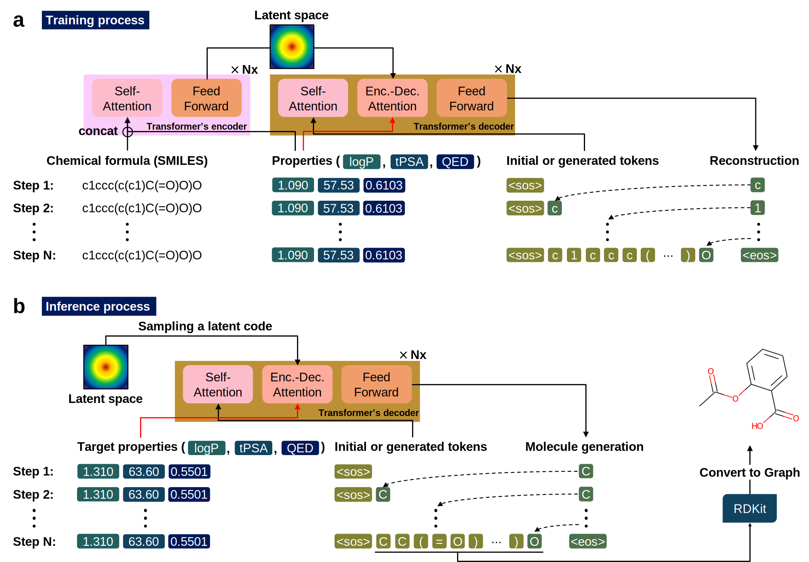
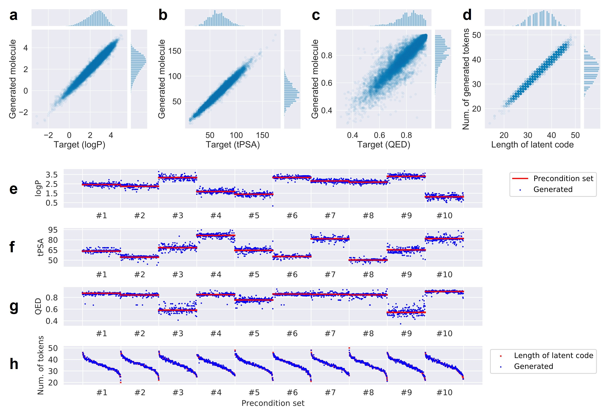
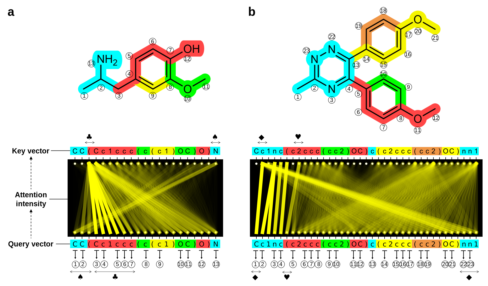
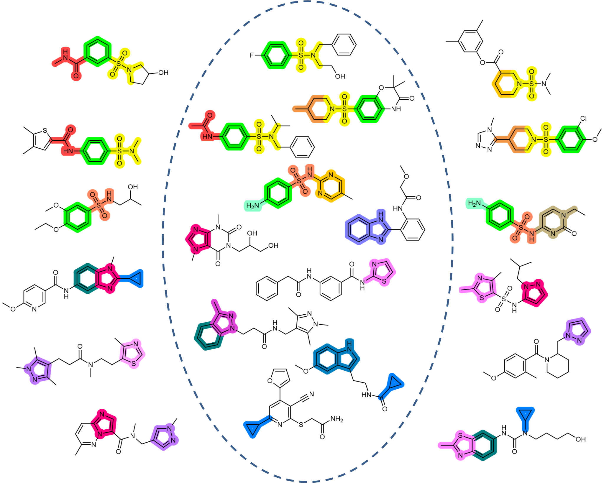
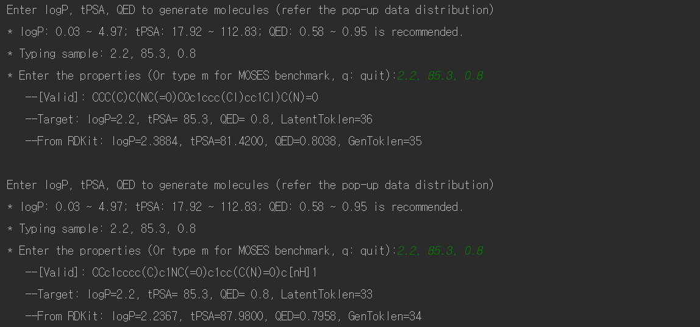

# Paper Info.
Hyunseung Kim, Jonggeol Na*, and Won Bo Lee*, "Generative Chemical Transformer: Neural Machine Learning of Molecular Geometric Structures from Chemical Language via Attention, " J. Chem. Inf. Model. 2021, 61, 12, 5804-5814  
[Featured as JCIM journal supplentary cover]  https://pubs.acs.org/doi/abs/10.1021/acs.jcim.1c01289  
<p align="center">
  

**Generative Chemical Transformer (GCT) directly designs hit-like materials matched given target properties. Transformer's high level of context-awareness ability of chemical language aids in designing molecules more realistic and vaild.**

# Citation
```
@article{kim2021generative,
  title={Generative Chemical Transformer: Neural Machine Learning of Molecular Geometric Structures from Chemical Language via Attention},
  author={Kim, Hyunseung and Na, Jonggeol and Lee, Won Bo},
  journal={Journal of Chemical Information and Modeling},
  volume={61},
  number={12},
  pages={5804--5814},
  year={2021},
  publisher={ACS Publications}
}
```

# molGCT: Transformer+cVAE  
**Overview of GCT: Tranining phase and Inference phase**  
   
  

**Design hit-like materials with 10-sets (#1~#10) of given target properties**  


**Attention mechanism aids in undertanding semantically related parts of molecular structure hidden in 1-dimensional chemical language**  

  

**GCT generates more realistic and valid based on the high level of chemical language comprehension of Transformer:**  
The molecules in circle are real molecules in MOSES database, and the molecules outside the circle are designed by GCT 

  

**Result examples**  
  
  

# Implementation
1. Set up your anaconda environment with the following code:
```
conda env create -f molgct_env.yaml
```

2. Run to train GCT:
```
python train.py
```

3. Run to infer molecules with the trained GCT:
```
python inference.py
```


# References
Basic Transformer code was borrowed and modified from: https://github.com/SamLynnEvans/Transformer  
Molecular data was borrowed from: https://github.com/molecularsets/moses/tree/master/data
